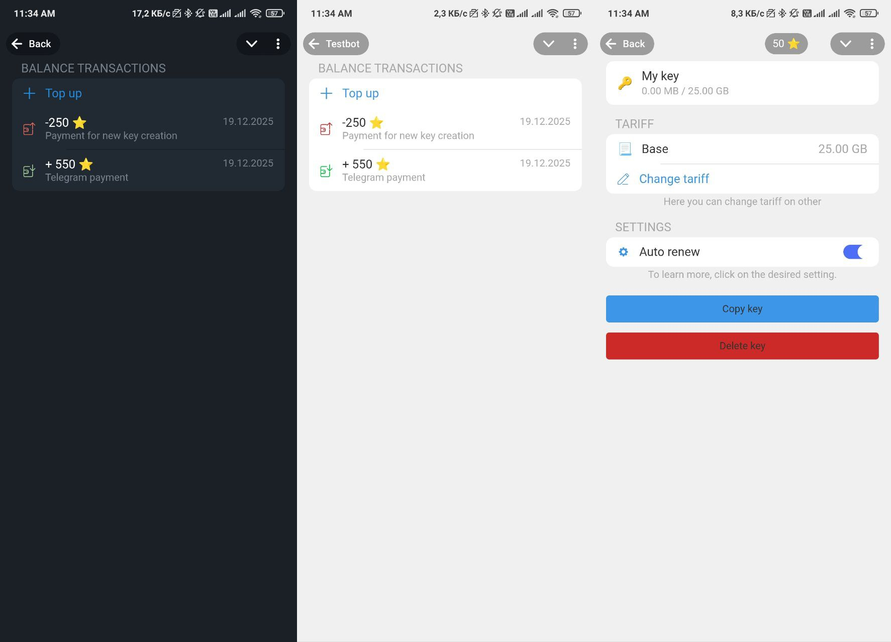

# Vless VPN manager

This repository contains vless VPN manager service, to sell vless keys to customers.
It has DNS management, user management, payment integration (Telegram stars), 
traffic monitoring, and a Telegram mini app for user convenience.

Users can buy keys through Telegram stars and manage their keys through the Telegram 
mini-app. DNS is used here, so you can easily change the user server if necessary.

## Features
- User management (add, delete, modify users)
- Key generation
- Server auto-setup
- Payment integration (Telegram stars)
- Traffic monitoring and limits
- Telegram mini app

## Tech Stack
- Backend: Django, Django Rest Framework
- Database: PostgreSQL
- Cache: Redis
- Containerization: Docker, Kubernetes
- CI/CD: GitHub Actions

## Deployment
The application can be deployed using Docker and Kubernetes.
Kubernetes manifests are available in the `k8s/` directory.

## Preview

